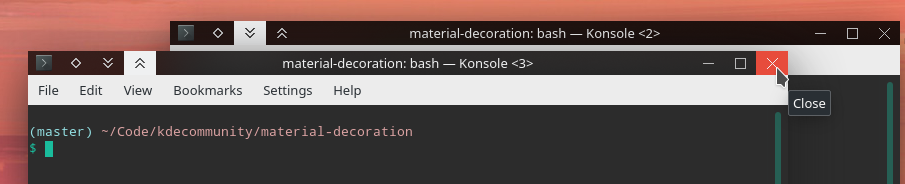

## material-decoration

Material-ish window decoration theme for KWin.

### Locally Integrated Menus

This `lim` branch hides the AppMenu icon button and draws the menu in the titlebar.


More discussion in the KDE Bug report: https://bugs.kde.org/show_bug.cgi?id=375951#c27

TODO/Bugs:

* Figure out how to detect when `decoration->windowId` changes so I can update `AppMenuModel->winId` as KWin reuses the decorations I think. It will sometimes show the menu for Dolphin over top a SublimeText window.
* Refactor to use `QMenuBar` or implement:
	* Switch submenu on Hover.
	* Switch submenu on Left/Right Arrow.
	* Open Submenu on Shortcut.
	* Display mnemonics when holding `Alt`.
* Filter empty menu items without a label.

Features:

* Hide menu on model windows.

### Installation

##### Prerequisites

* KDecoration2

The following command should probably install all the build dependency libraries.

```
sudo apt build-dep breeze
```

##### Building from source

```
mkdir build
cd build
cmake -DCMAKE_INSTALL_PREFIX=/usr ..
make
sudo make install
```

To test, restart `kwin_x11` with:

```
QT_LOGGING_RULES="*=false;kdecoration.material=true" kstart5 -- kwin_x11 --replace
```
